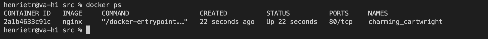
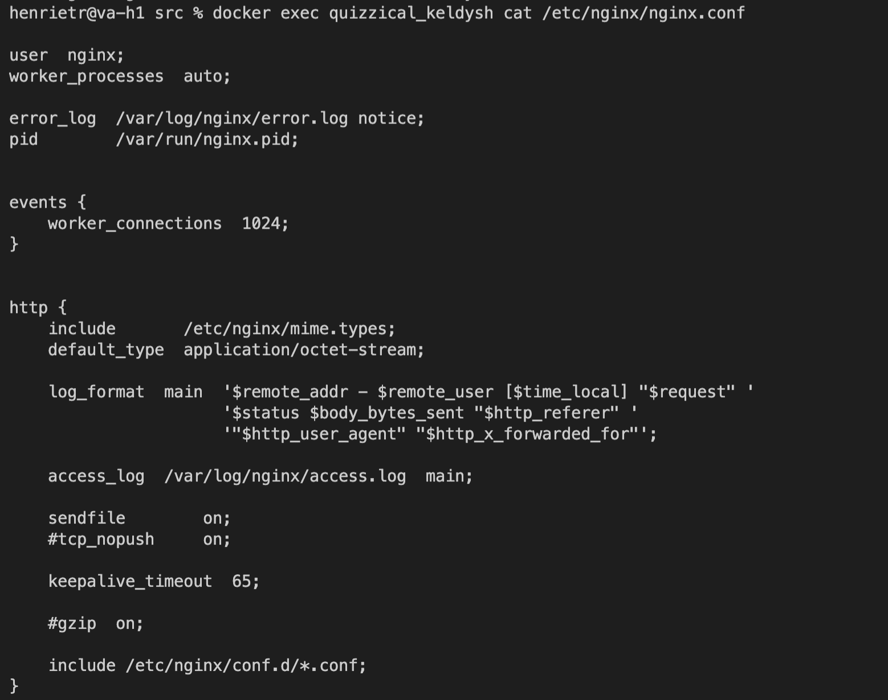
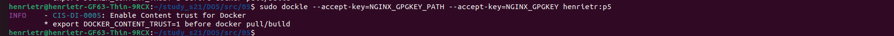

# Simple Docker

## Оглавление:

1. [Готовый докер](#part-1-готовый-докер)
2. [Операции с контейнером](#part-2-операции-с-контейнером)
3. [Мини веб-сервер](#part-3-мини-веб-сервер)
4. [Свой докер](#part-4-свой-докер)
5. [Dockle](#part-5-dockle)
6. [Базовый Docker Compose](#part-6-базовый-docker-compose)

## Part 1. Готовый докер.

- Взять официальный докер образ с nginx и выкачать его при помощи docker pull

- Проверить наличие докер образа через docker images

- Запустить докер образ через docker run -d [image_id|repository]

- Проверить, что образ запустился через docker ps

- Посмотреть информацию о контейнере через docker inspect [container_id|container_name]

- По выводу команды определить и поместить в отчёт размер контейнера, список замапленных портов и ip контейнера

- Остановить докер образ через docker stop [container_id|container_name]

- Проверить, что образ остановился через docker ps

- Запустить докер с портами 80 и 443 в контейнере, замапленными на такие же порты на локальной машине, через команду run

- Проверить, что в браузере по адресу localhost:80 доступна стартовая страница nginx

- Перезапустить докер контейнер через docker restart [container_id|container_name]

- Проверить любым способом, что контейнер запустился

## Part 2. Операции с контейнером.

- Прочитать конфигурационный файл nginx.conf внутри докер контейнера через команду exec

- Создать на локальной машине файл nginx.conf

- Настроить в нем по пути /status отдачу страницы статуса сервера nginx

- Скопировать созданный файл nginx.conf внутрь докер образа через команду docker cp

- Перезапустить nginx внутри докер образа через команду exec

- Проверить, что по адресу localhost:80/status отдается страничка со статусом сервера nginx

- Экспортировать контейнер в файл container.tar через команду export

- Остановить контейнер

- Удалить образ через docker rmi [image_id|repository], не удаляя перед этим контейнеры

- Удалить остановленный контейнер

- Импортировать контейнер обратно через команду import

- Запустить импортированный контейнер

- Проверить, что по адресу localhost:80/status отдается страничка со статусом сервера nginx

## Part 3. Мини веб-сервер.

- Написать мини сервер на C и FastCgi, который будет возвращать простейшую страничку с надписью Hello World!

- Запустить написанный мини сервер через spawn-fcgi на порту 8080

- Написать свой nginx.conf, который будет проксировать все запросы с 81 порта на 127.0.0.1:8080

- Проверить, что в браузере по localhost:81 отдается написанная вами страничка

- Положить файл nginx.conf по пути ./nginx/nginx.conf (это понадобится позже)

## Part 4. Свой докер.

- Написать свой докер образ, который:

    1. собирает исходники мини сервера на FastCgi из Части 3

    2. запускает его на 8080 порту

    3. копирует внутрь образа написанный ./nginx/nginx.conf

    4. запускает nginx

- Собрать написанный докер образ через docker build при этом указав имя и тег

- Проверить через docker images, что все собралось корректно

- Запустить собранный докер образ с маппингом 81 порта на 80 на локальной машине и маппингом папки ./nginx внутрь контейнера по адресу, где лежат конфигурационные файлы nginx'а (см. Часть 2)

- Проверить, что по localhost:80 доступна страничка написанного мини сервера

- Дописать в ./nginx/nginx.conf проксирование странички /status, по которой надо отдавать статус сервера nginx

- Перезапустить докер образ

- Проверить, что теперь по localhost:80/status отдается страничка со статусом nginx

## Part 5. Dockle.

- Просканировать образ из предыдущего задания через dockle [image_id|repository]

- Исправить образ так, чтобы при проверке через dockle не было ошибок и предупреждений

## Part 6. Базовый Docker Compose.

- Написать файл docker-compose.yml, с помощью которого:

    1. Поднять докер контейнер из Части 5 (он должен работать в локальной сети, т.е. не нужно использовать инструкцию EXPOSE и мапить порты на локальную машину)

    2. Поднять докер контейнер с nginx, который будет проксировать все запросы с 8080 порта на 81 порт первого контейнера

- Замапить 8080 порт второго контейнера на 80 порт локальной машины

- Остановить все запущенные контейнеры

- Собрать и запустить проект с помощью команд docker-compose build и docker-compose up

- Проверить, что в браузере по localhost:80 отдается написанная вами страничка, как и ранее

